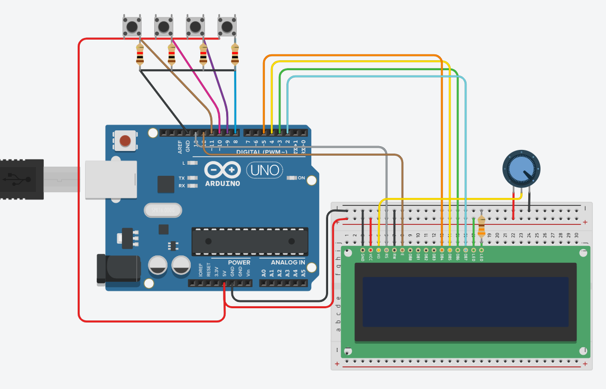

# arduino_game_code
Author: James Chen

Simple Arduino game with spelling and math.
Inside the game_code folder is code for a simple arduino game
that had math and spelling game modes.

See physical setup of Arduino, and LCD below:

